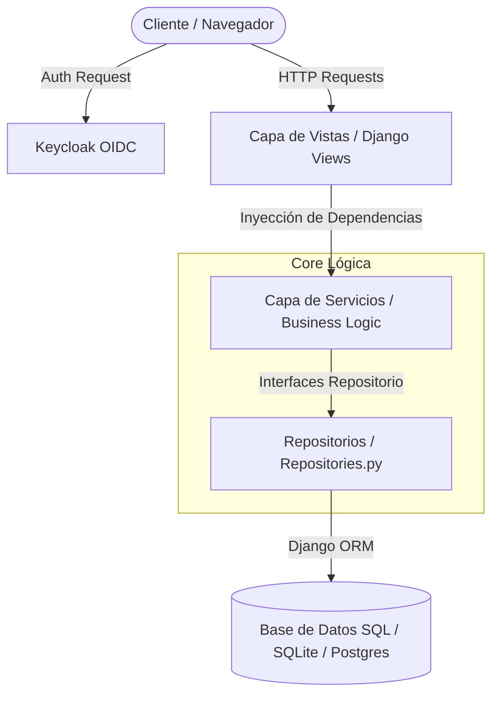

<<<<<<< HEAD
# 🧵 Textil-APP (Texcore)
=======
#  Textil-APP (Texcore)
>>>>>>> 69bcafcab7f8dc805455b122a78ec85fb8fca666


Sistema integral para el control y gestión de procesos de producción textil. Diseñado bajo **Clean Architecture** (Principios SOLID, patrones Repositorio y Estrategia) para permitir el seguimiento riguroso del inventario de materia prima, fases de preparación y transformación en hilatura.

---

<<<<<<< HEAD
## 📐 Arquitectura del Sistema
=======
##  Arquitectura del Sistema
>>>>>>> 69bcafcab7f8dc805455b122a78ec85fb8fca666

El proyecto sigue una estructura desacoplada para garantizar escalabilidad y facilidad de pruebas:



---

<<<<<<< HEAD
## ✨ Características Principales
=======
##  Características Principales
>>>>>>> 69bcafcab7f8dc805455b122a78ec85fb8fca666
*   **Gestión de Materia Prima:** Control de inventarios iniciales, lotes y trazabilidad de ingresos.
*   **Fase de Preparación:** Registro y monitoreo de procesos (limpieza, apertura, mezcla y ajuste de proporciones), incluyendo mermas y rendimientos.
*   **Fase de Hilatura:** Control secuencial de etapas de transformación (cardado, peinado e hilado).
*   **Autenticación Centralizada (SSO):** Conexión segura con Keycloak. Implementa **SSO Silencioso** (`SilentSSOMiddleware`) permitiendo la sincronización invisible de la sesión con otras aplicaciones del ecosistema.
*   **Control de Acceso Basado en Roles (RBAC):** Redirecciones y vistas protegidas para roles: `admin`, `preparador`, `operario`.

---

<<<<<<< HEAD
## 🛠️ Requisitos Previos
=======
##  Requisitos Previos
>>>>>>> 69bcafcab7f8dc805455b122a78ec85fb8fca666
*   Python 3.11 o superior.
*   Instancia activa de Keycloak (puede desplegarse localmente vía Docker).

---

<<<<<<< HEAD
## ⚙️ Configuración del Entorno Local
=======
##  Configuración del Entorno Local
>>>>>>> 69bcafcab7f8dc805455b122a78ec85fb8fca666

1.  **Clonar el repositorio:**
    ```bash
    git clone <url-del-repositorio>
    cd Textil-APP
    ```

2.  **Entorno virtual y Dependencias:**
    ```powershell
    python -m venv .venv
    .\.venv\Scripts\Activate.ps1   # Windows (PowerShell)
    # source .venv/bin/activate    # Linux/Mac
    pip install -r requirements.txt
    ```

3.  **Variables de Entorno (.env):**
    Crea un archivo `.env` en la raíz del proyecto basándote en `.env.example`:
    ```env
    DEBUG=True
    SECRET_KEY=tu_secreto_django
    DJANGO_SETTINGS_MODULE=LoginCRUD.settings.development
    
    # Keycloak Configuration
    KEYCLOAK_URL=http://localhost:8080
    KC_REALM=textil-realm
    KC_CLIENT_ID=textil-app-a
    KC_CLIENT_SECRET=tu-client-secret-de-keycloak
    ```

4.  **Base de Datos y Migraciones:**
    ```bash
    python manage.py migrate
    python manage.py runserver
    ```

---

<<<<<<< HEAD
## 🔐 Configuración Requerida en Keycloak
=======
##  Configuración Requerida en Keycloak
>>>>>>> 69bcafcab7f8dc805455b122a78ec85fb8fca666
Para que el SSO y el inicio de sesión funcionen correctamente, tu Realm en Keycloak debe contar con:
1.  **Realm Name:** `textil-realm` (o el configurado en tu `.env`).
2.  **Client:** `textil-app-a` configurado como **Confidential**.
    *   **Valid Redirect URIs:** `http://localhost:8000/keycloak/callback/`
    *   **Post Logout Redirect URIs:** `http://localhost:8000/`
3.  **Roles de Cliente:** Crear los roles `admin`, `preparador` y `operario` y asignarlos a tus respectivos usuarios.
