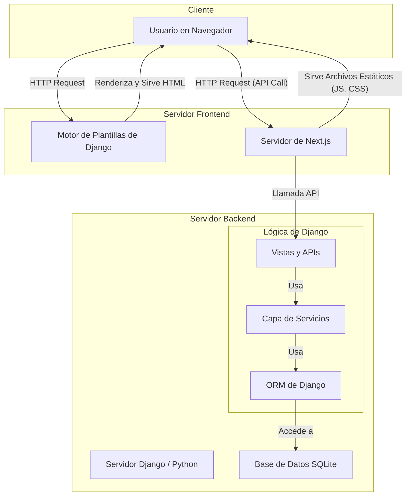

# Documentación de Arquitectura

Este documento describe la arquitectura de alto nivel del proyecto, incluyendo los diferentes componentes de frontend y backend y cómo se comunican entre sí.

---

## 1. Diagrama de Arquitectura

El proyecto está compuesto por un backend monolítico de Django que sirve tanto plantillas HTML directamente como una API REST para un cliente de JavaScript moderno.



---

## 2. Los Dos Frontends del Proyecto

Una característica particular de este proyecto es que cuenta con **dos tipos de frontend** que coexisten y se conectan al mismo backend de Django.

### Frontend 1: Plantillas de Django (Server-Side Rendered)

-   **Ubicación:** `Texcore/templates/`
-   **Descripción:** Este es el enfoque tradicional de Django. El servidor renderiza plantillas HTML (`.html`) y las envía al navegador del cliente. La interacción es a través de formularios que recargan la página y enlaces.
-   **Conexión con el Backend:** La conexión es directa e interna. Las vistas de Django (`Texcore/views/`) procesan una solicitud, ejecutan lógica de negocio (a través de los servicios) y pasan datos a una plantilla. El resultado es una página HTML completa que se devuelve al usuario. Este es el flujo que se usa para el CRUD de Materia Prima, los dashboards, etc.

### Frontend 2: Next.js (Client-Side Application)

-   **Ubicación:** `frontend/`
-   **Descripción:** Este es un frontend moderno y desacoplado, construido con Next.js (un framework de React). Esta aplicación se ejecuta en el navegador del cliente y es responsable de su propia interfaz y estado. Proporciona una experiencia de usuario más fluida y dinámica, similar a una "Single-Page Application" (SPA).
-   **Conexión con el Backend:** Este frontend se comunica con el backend de Django a través de una **API REST**, no renderizando plantillas. Django expone *endpoints* que devuelven datos en formato JSON.
    -   Los archivos en `Texcore/views/auth_api.py` definen estos endpoints. Por ejemplo:
        -   `login_view`: Permite a la aplicación Next.js autenticar a un usuario enviando un `username` y `password` en formato JSON.
        -   `user_view`: Permite a la aplicación Next.js obtener los datos del usuario actualmente autenticado.
        -   `logout_view`: Permite cerrar la sesión.
    -   La autenticación se gestiona mediante cookies de sesión. El backend de Django establece una cookie (`sessionid`) después de un login exitoso, y el navegador la envía automáticamente en las solicitudes posteriores a la API, permitiendo al backend identificar al usuario.

---

## 3. ¿Cómo Demostrar la Conexión?

Para demostrar que ambos frontends funcionan y se conectan al mismo backend, puedes seguir estos pasos:

1.  **Ejecutar el Backend de Django:**
    ```bash
    python manage.py runserver
    ```
    Esto levanta el servidor en `http://localhost:8000`.

2.  **Probar el Frontend de Plantillas:**
    -   Abre `http://localhost:8000/login/` en tu navegador.
    -   Inicia sesión con un usuario de prueba.
    -   Navega por el CRUD de materias primas. Estás usando el frontend renderizado por el servidor.

3.  **Ejecutar y Probar el Frontend de Next.js:**
    -   Abre una nueva terminal y navega a la carpeta `frontend`:
      ```bash
      cd frontend
      ```
    -   Instala las dependencias y ejecuta el servidor de desarrollo de Next.js (los comandos pueden variar, pero usualmente son):
      ```bash
      npm install
      npm run dev
      ```
    -   Esto levantará el frontend de Next.js en un puerto diferente (generalmente `http://localhost:3000`).
    -   Abre `http://localhost:3000` en tu navegador. Deberías ver la interfaz de la aplicación de Next.js.
    -   Usa el formulario de login de *esta* aplicación. Cuando inicies sesión:
        -   En la pestaña "Network" de las herramientas de desarrollador de tu navegador, verás una solicitud `POST` a `http://localhost:8000/api/login/` (o la URL que corresponda).
        -   Si la autenticación es correcta, el backend de Django devolverá una respuesta JSON y establecerá una cookie de sesión.
        -   La aplicación de Next.js te redirigirá a una página protegida, demostrando que ha establecido una sesión con el mismo backend que usan las plantillas de Django.

Haciendo esto, demuestras que tienes un único backend de Django que da servicio a dos experiencias de usuario completamente diferentes: una tradicional basada en plantillas y una moderna basada en una SPA y una API REST.
