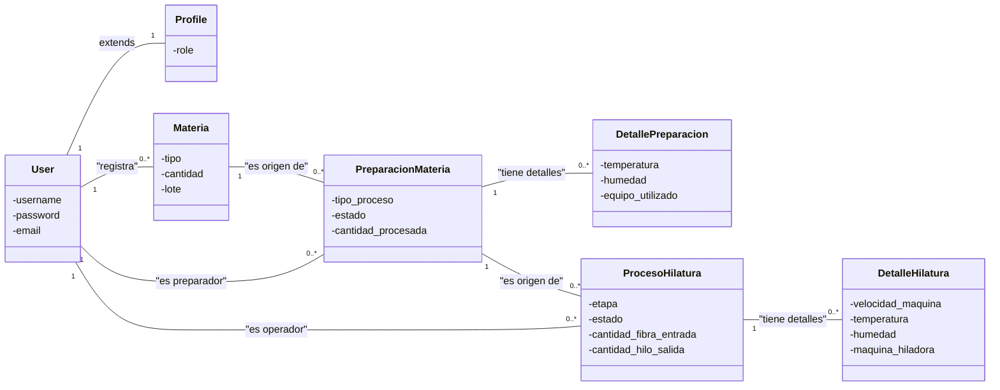
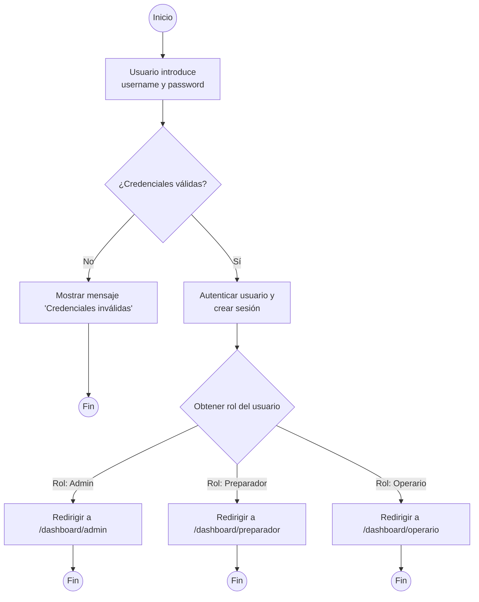

# Diagramas Adicionales del Sistema

Este documento proporciona diagramas de alto nivel para entender la estructura, el uso y los flujos del proyecto.

---

## 1. Diagrama de Clases

Este diagrama muestra los modelos de datos más importantes del sistema y las relaciones entre ellos. Se centra en las entidades principales de la aplicación `Texcore`.



---

## 2. Diagrama de Casos de Uso

Este diagrama ilustra las interacciones entre los diferentes tipos de usuarios (actores) y el sistema. Muestra las funcionalidades clave que cada rol puede realizar.

```mermaid
usecase "Casos de Uso del Sistema"
    actor "Usuario no autenticado" as UA
    actor "Usuario Autenticado" as UU
    actor "Administrativo" as A
    actor "Preparador" as P
    actor "Operario" as O

    A --|> UU
    P --|> UU
    O --|> UU

    rectangle "Sistema" {
        usecase "Iniciar Sesión" as UC1
        usecase "Cerrar Sesión" as UC2
        usecase "Ver Dashboard Personal" as UC3
        usecase "Gestionar CRUD de Materias Primas" as UC4
        usecase "Gestionar Procesos de Preparación" as UC5
        usecase "Gestionar Procesos de Hilatura" as UC6
        usecase "Ver Reportes Globales" as UC7
        usecase "Gestionar Usuarios y Roles" as UC8
    }

    UA --> UC1
    UU --> UC2
    UU --> UC3
    O --> UC4
    P --> UC5
    O --> UC6
    A --> UC7
    A --> UC8
```

---

## 3. Diagrama de Flujo (Proceso de Login)

Este diagrama de flujo detalla los pasos que sigue el sistema cuando un usuario intenta iniciar sesión, desde que introduce sus credenciales hasta que es redirigido a su panel de control correspondiente.


