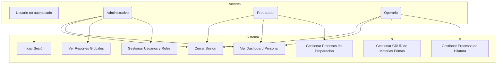
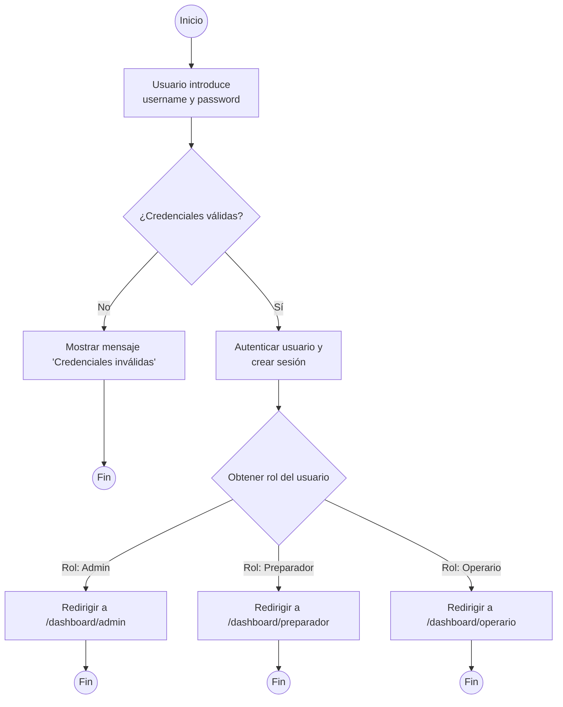
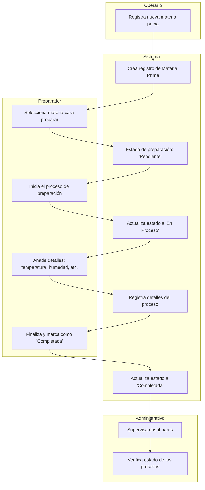

# Diagramas Adicionales del Sistema

Este documento proporciona diagramas de alto nivel para entender la estructura, el uso y los flujos del proyecto.

---

## 1. Diagrama de Clases

Este diagrama muestra los modelos de datos más importantes del sistema y las relaciones entre ellos. Se centra en las entidades principales de la aplicación `Texcore`.

---

## 2. Diagrama de Casos de Uso

Este diagrama ilustra las interacciones entre los diferentes tipos de usuarios (actores) y el sistema. Muestra las funcionalidades clave que cada rol puede realizar.

---

## 3. Diagrama de Flujo (Proceso de Login)

Este diagrama de flujo detalla los pasos que sigue el sistema cuando un usuario intenta iniciar sesión, desde que introduce sus credenciales hasta que es redirigido a su panel de control correspondiente.

---

## 4. Diagrama de Carriles (Swimlane) - Proceso de Preparación

Este diagrama de carriles muestra cómo el proceso de preparación de materia prima fluye a través de diferentes roles (Operario, Preparador, Administrativo) y el sistema.

