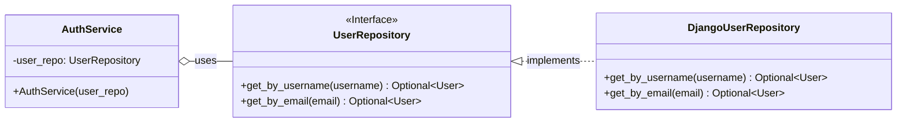
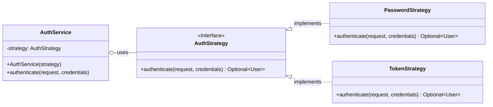

# Documentación de Diseño y Patrones

Este documento detalla los patrones de diseño clave implementados en el proyecto, el razonamiento detrás de su elección y cómo mejoran la arquitectura general.

---

## 1. Patrón de Repositorio (Repository Pattern)

El Patrón de Repositorio se utiliza para desacoplar la lógica de negocio del acceso a los datos. Creamos una capa de abstracción entre la lógica de la aplicación y las consultas al ORM de Django, lo que nos permite centralizar el acceso a datos y hacerlo más mantenible.

### Diagrama UML (Mermaid)

### ¿Por qué se ajusta a nuestro proyecto?

1.  **Centralización del Acceso a Datos:** En lugar de tener consultas `User.objects.get(...)` dispersas por todo el código (vistas, otros servicios), todas las operaciones relacionadas con los usuarios se centralizan en `DjangoUserRepository`. Si el modelo `User` cambia, solo tenemos que actualizar el repositorio.

2.  **Facilita las Pruebas Unitarias:** Este es el beneficio más importante. Al depender de la interfaz `UserRepository`, podemos "engañar" a los servicios (`AuthService`) pasándoles un repositorio falso (un "mock") durante las pruebas. Esto nos permite probar la lógica de negocio en total aislamiento, sin necesidad de una base de datos real, haciendo los tests más rápidos y fiables.

3.  **Flexibilidad a Futuro:** Si en el futuro decidiéramos cambiar de ORM o incluso obtener datos de una fuente externa (como una API), solo necesitaríamos crear una nueva implementación de `UserRepository` sin tener que cambiar la lógica de negocio que lo consume.

### ¿Cómo mejora el proyecto?

-   **Testabilidad:** El código es mucho más fácil de probar.
-   **Mantenibilidad:** La lógica de acceso a datos está en un solo lugar, facilitando su modificación y evitando la duplicación de código.
-   **Desacoplamiento:** Reduce la dependencia directa del ORM de Django en las capas altas de la aplicación.

---

## 2. Patrón de Estrategia (Strategy Pattern)

El Patrón de Estrategia nos permite definir una familia de algoritmos, encapsular cada uno de ellos y hacerlos intercambiables. En nuestro caso, lo utilizamos para definir diferentes formas de autenticar a un usuario.

### Diagrama UML (Mermaid)

### ¿Por qué se ajusta a nuestro proyecto?

1.  **Múltiples Métodos de Autenticación:** El proyecto podría necesitar diferentes formas de validar a un usuario. Actualmente, usamos usuario/contraseña (`PasswordStrategy`). En el futuro, podríamos querer añadir autenticación a través de un token de API (`TokenStrategy`) o incluso redes sociales (ej. `GoogleAuthStrategy`).

2.  **Cumple con el Principio de Abierto/Cerrado (Open/Closed Principle):** Podemos añadir nuevas estrategias de autenticación sin tener que modificar el `AuthService` que las utiliza. El servicio está "abierto" a la extensión (nuevas estrategias) pero "cerrado" a la modificación.

### ¿Cómo mejora el proyecto?

-   **Flexibilidad y Escalabilidad:** Añadir nuevas formas de autenticar es tan simple como crear una nueva clase que implemente la interfaz `AuthStrategy`.
-   **Código Limpio:** Evita tener un `AuthService` lleno de condicionales (`if/elif/else`) para manejar cada tipo de autenticación. La lógica de cada método está encapsulada en su propia clase.
-   **Desacoplamiento:** El `AuthService` no sabe (ni le importa) qué estrategia concreta está usando; solo sabe que puede llamar al método `authenticate`.

---

## Conclusión

La combinación de estos patrones, junto con el **Principio de Inversión de Dependencias (DIP)**, transforma nuestra arquitectura de una fuertemente acoplada (vistas que llaman directamente al ORM) a una flexible, mantenible y, sobre todo, altamente testeable.
